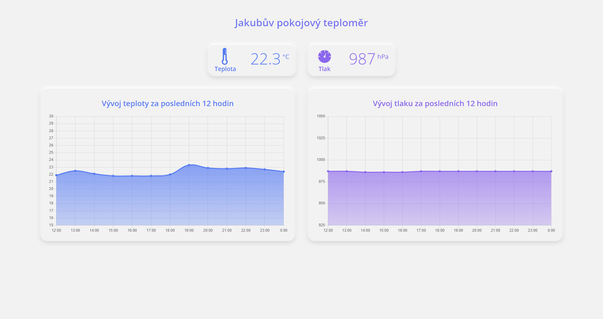

# Jakubuv_teplomer

#### Ročníková práce pro 3. ročník 
[Jakubův teploměr](http://jakubsirovy.cz/teplomer.html)  
Ročníková práce na téma IoT.  
#### Skládá se z:
- ESP8266
- Senzor teploty BMP280
- Raspberry Pi
